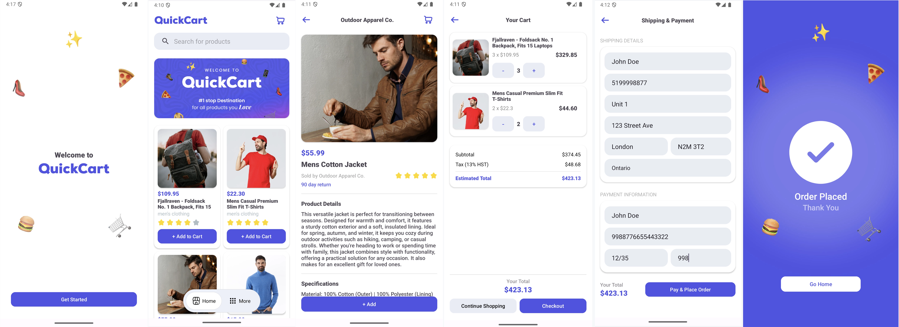

# QuickCart

QuickCart is an e-commerce Android application developed using **Android Studio Lady Bird**, **Java**, and **Firebase**. The app provides a seamless shopping experience, enabling users to browse through a wide range of products, add items to their cart, and place orders with ease.

---

## Features

- **Sign Up and Login**: Securely create an account or log in using Firebase Authentication.
- **View Products**: Browse various categories of products with images, prices, and descriptions.
- **Product Details**: View detailed information about individual products.
- **Add to Cart**: Add your favorite items to the cart for later purchase.
- **View Cart**: Manage items in the cart, update quantities, or remove products.
- **Checkout and Place Order**: Easily place orders and proceed to checkout with a streamlined process.
- **Order History**: View a list of your past orders and their statuses.

---

## Tech Stack

- **Language**: Java  
- **Development Environment**: Android Studio Lady Bird  
- **Backend**: Firebase (Authentication and Firestore Database)

---

## Installation

1. Clone the repository:
   ```bash
   git clone https://github.com/bibintomj/quickcart-android.git
   ```

2. Open the project in Android Studio Lady Bird.

3. Sync the Gradle files and ensure all dependencies are installed.

4. Set up Firebase:
   - Add your Firebase project credentials (`google-services.json`) to the app's `app` directory.
   - Configure Authentication and Firestore/Realtime Database in your Firebase console.

5. Build and run the app on an emulator or a physical device.

---

## Screenshot



---

## License

This project is licensed under the MIT License. See the [LICENSE](LICENSE) file for details.

---

## Contact

For any queries, feel free to reach out at:  
**Email**: bibintomj@gmail.com  
**GitHub**: [bibintomj](https://github.com/bibintomj)
